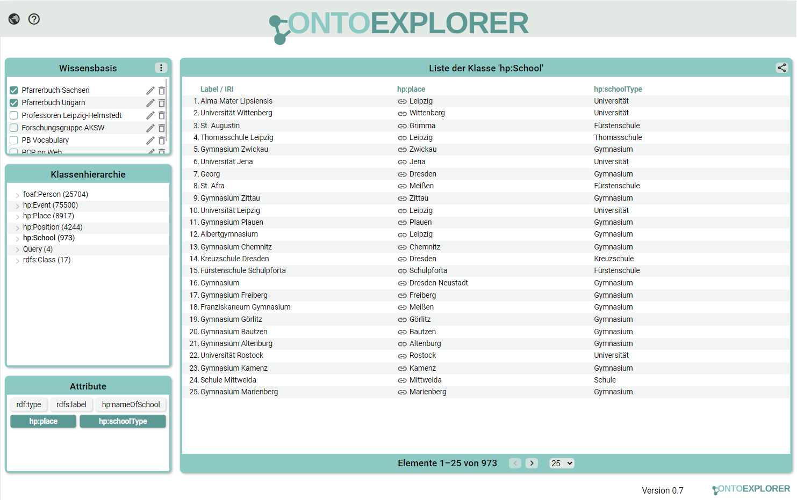

# OntoExplorer

## About

Der OntoExplorer bietet einen Einblick in SPARQL-Endpunkte des Semantic Web und ermöglicht das Explorieren durch, das Recherchieren nach und das Filtern von RDF-Datensätzen in diesen Endpunkten. Dafür können die Endpunkte manuell verwaltet werden, die Ergebnisliste mit Attributen angereichert werden und die Seitenansicht, sowie die Konfiguration der Endpunkte mit anderen Nutzern geteilt werden.





(Weitere Hinweise zur Benutzung sind im Ontoexplorer auf der Hilfeseite hinter dem Fragezeichen zu finden.)

## Installation

Der Ontoexplorer kann entweder auf einen Webserver deployed oder lokal genutzt werden. Für die lokale Nutzung ist es nötig, dass Node installiert ist (bei der Entwicklung kamen vor allem Node 14 und 16 zum Einsatz) und npm darin enthalten ist.

Außerdem sind folgende Schritte zur Installation notwendig:

### Project-Setup:
```
npm ci 
```
### Compiles and hot-reloads for development:
```
npm run serve
```
### Compiles and minifies for production:
```
npm run build
```
### Lints and fixes files
```
npm run lint
```

## Instant installation using builds from GitLab CI

Das GitLab-Repository bietet aktuell generierte Builds über CI/CD. Hier ist eine laufähige Installation für ein Webroot-Verzeichnis verfügbar. 

https://gitlab.imn.htwk-leipzig.de/ontoexplorer/ontoexplorer/-/jobs/104939/artifacts/download?file_type=archive

## Konfiguration von fest definierten Endpunkten

Die fest definierten Endpunkte werden in [default-config.json](public/default-config.json) mit den folgenden Angaben für den jeweiligen Endpunkt konfiguriert:

```json
[
  {
    "name": "Endpoint display name",
    "url": "https://endpoint.url/sparql",
    
    "usesOWL": false,
    "authorization": {
      "user": "user",
      "password": "password"
    },
    "headers": {
      "CUSTOM_HEADER": "value"
    }
  },
]
```

Dabei sind die Parameter `name` und `url` unbedingt nötig, alle weiteren sind optional. Der Parameter `usesOWL` gibt dabei an, ob der SPARQL-Server OWL benutzt, der Default-Wert ist `false`. Für SPARQL-Endpunkte, bei denen eine Authentifikation nötig ist, kann diese unter `authorization` mit `user` und `password` angegeben werden. Außerdem können unter `headers` weitere Header für Abfragen an den Endpunkt angegeben werden.

## Dokumentation
### Coding
* TypeScript, welches in Vue-Komponenten verwendet wird, sollte sich nicht in den .vue-Dateien direkt befinden, sondern in gleichnamige .ts-Dateien ausgelagert werden.
* Klassen müssen für die Dokumentationsgenerierung in src/tsdoc-index.ts indiziert werden
* Für Einrückungen sollen Leerzeichen verwendet werden. 1 Einrückung entspricht dabei 2 Leerzeichen
* [Vue-Coding Style ](https://v3.vuejs.org/style-guide/)

### Code-Dokumentation
Richtlinien:
* Es sollen Klassen und Funktionen in TypeScript-Dateien dokumentiert werden. 
* Inline-Kommentare sind möglichst du vermeiden. Die Dokumentation soll nach Möglichkeit in Englisch erfolgen.
* [Documentation Style](https://vue-styleguidist.github.io/docs/Documenting.html)

Installieren von typedoc global:
```
npm install -g typedoc
```
Generieren eine Dokumentation in /docs:
```
typedoc src/tsdoc-index.ts 
```


### Tests
* Für Tests wird [Jest](https://jestjs.io/) verwendet. 
* Tests sollen unter tests/unit liegen und *.spec.ts benannt werden.
* Ziel: Testabdeckung soll bei 50% liegen

Ausführen der Tests und Berechnung der Testabdeckung:
```
npm run test:unit
```

### Anpassen der Konfiguration
Siehe [Configuration Reference](https://cli.vuejs.org/config/).


## Styleguide
Der in diesem Projekt verwendete Styleguide ist [hier](OE_Styleguide.pdf) zu finden.

## Verwendete Lizenz
Der OntoExplorer ist lizensiert unter der [MIT-Lizenz](LICENSE).
